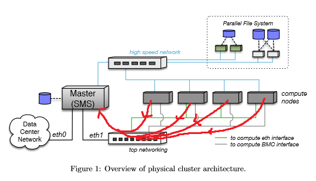

주로 설명이 위에 있고 그림이나 코드가 아래에 

# OpenHPC-Warewulf-Slurm
Using OpenHPC-Warewulf-Slurm, make High Performance Computer


## 0. H/W Requirements for this recipe
1. Head Node (DELL R720)  
  1-1. SSD (리뷰안 dx2200 * 2 , 리뷰안 960x * 2)
2. Compute Node * 10 (Quanta Computer Windmill)  
  2-1. Infiniband card  
  2-2. SSD 
3. IP router (iptime)
4. Infiniband Switch (mellanox)

## 1. Installation Centos7.6
1. Install CentOS 7.6 on Head Node
centos7.6을 usb를 이용하여 부팅하면 다음과 같은 화면이 나타난다.

INSTALLATION SOURCE에서 설치할 디스크와 파티션을 잘 나누어주고
SOFTWARE SELECTION에서 GUI만 선택하고 (추가 애드온 없이) DONE한다

## 2. Installation OpenHPC
### 2-1 . Export Environment Variables
여기서 사용할 환경 변수들에 대한 설명이다  
~~줄그어진~~ 변수들은 설명서에는 있지만 여기서는 사용하지 않는 것들이다.  

• ${sms name} # Hostname for SMS server  
• ${sms ip} # Internal IP address on SMS server   
• ${sms eth internal} # Internal Ethernet interface on SMS   
• ${eth provision} # Provisioning interface for computes   
• ${internal netmask} # Subnet netmask for internal network   
• ${ntp server} # Local ntp server for time synchronization   
• ~~${bmc username} # BMC username for use by IPMI~~  
• ~~${bmc password} # BMC password for use by IPMI~~  
• ${num computes} # Total # of desired compute nodes   
• ${c ip[0]}, ${c ip[1]}, ... # Desired compute node addresses   
• ${c bmc[0]}, ${c bmc[1]}, ... # BMC addresses for computes  
• ${c mac[0]}, ${c mac[1]}, ... # MAC addresses for computes  
• ${c name[0]}, ${c name[1]}, ... # Host names for computes   
• ${compute regex} # Regex matching all compute node names (e.g. “c*”)   
• ${compute prefix} # Prefix for compute node names (e.g. “c”) Optional  
• ~~${sysmgmtd host} # BeeGFS System Management host name~~  
• ~~${mgs fs name} # Lustre MGS mount name~~  
• ${sms ipoib} # IPoIB address for SMS server  
• ${ipoib netmask} # Subnet netmask for internal IPoIB  
• ${c ipoib[0]}, ${c ipoib[1]}, ... # IPoIB addresses for computes  
• ${kargs} # Kernel boot arguments  
• ~~${nagios web password} # Nagios web access password~~  

이런 변수들은 매번 치는게 어려우니 텍스트파일에 저장해놓고 필요할 때 마다 복사해서 export하도록 한다. 

### 2-2. Route setting
**가장 앞서 공유기의 DHCP를 비활성화 한다**  
앞으로 pxe부팅을 하게 될 것인데 그에 앞서 라우팅 세팅을 한다.
  
이 세팅을 하는 이유는 각각의 computenode가 pxe boot 할 때 gateway에 있는 서버에 접속하여 부팅이미지를 다운받게 되는데 그 gateway를 헤드노드로 지정할 수 있도록 해야한다.
```
route -add -net 192.168.0.0 netmask 255.255.255.0 dev em2
```
이 코드가 아니더라도 GUI의 setting에서 network설정을 통해 route를 설정하는 것도 좋다

### 2-3. Install Base Operating System
호스트를 등록하고 방화벽을 해제한다.
```
[sms]# echo ${sms_ip} ${sms_name} >> /etc/hosts
[sms]# systemctl disable firewalld 
[sms]# systemctl stop firewalld
```

### 2-4. Install OpenHPC Components

OpenHPC 설치
```
[sms]# yum install http://build.openhpc.community/OpenHPC:/1.3/CentOS_7/x86_64/ohpc-release-1.3-1.el7.x86_64.rpm
```
Add provisioning services on master node
```
[sms]# yum -y install ohpc-base
[sms]# yum -y install ohpc-warewul
```
NTP setup
```
[sms]# systemctl enable ntpd.service
[sms]# echo "server ${ntp_server}" >> /etc/ntp.conf 
[sms]# systemctl restart ntpd
```
Add resource management services on master node
여기서 나오는 slurm.conf가 나중에 slurm을 세팅하는 중요한 파일이 된다. 지금은 넘어가도록 한다  
```
[sms]# yum -y install ohpc-slurm-server
[sms]# perl -pi -e "s/ControlMachine=\S+/ControlMachine=${sms_name}/" /etc/slurm/slurm.conf
```
Optionally add InfiniBand support services on master node  
말그대로 인피니밴드가 있다면 설치하면 된다
```
[sms]# yum -y groupinstall "InfiniBand Support" 
[sms]# yum -y install infinipath-psm
[sms]# systemctl start rdma
```
인피니밴드를 설치하였다면 opensm도 설치해주자
```
[sms]# yum -y install opensm
[sms]# service opensm start
```
인피니밴드 네트워크 세팅
```
[sms]# cp /opt/ohpc/pub/examples/network/centos/ifcfg-ib0 /etc/sysconfig/network-scripts
[sms]# perl -pi -e "s/master_ipoib/${sms_ipoib}/" /etc/sysconfig/network-scripts/ifcfg-ib0 
[sms]# perl -pi -e "s/ipoib_netmask/${ipoib_netmask}/" /etc/sysconfig/network-scripts/ifcfg-ib0
[sms]# ifup ib0
```
Complete basic Warewulf setup for master node
```
[sms]# perl -pi -e "s/device = eth1/device = ${sms_eth_internal}/" /etc/warewulf/provision.conf
[sms]# perl -pi -e "s/^\s+disable\s+= yes/ disable = no/" /etc/xinetd.d/tftp
[sms]# ifconfig ${sms_eth_internal} ${sms_ip} netmask ${internal_netmask} up
[sms]# systemctl restart xinetd
[sms]# systemctl enable mariadb.service
[sms]# systemctl restart mariadb
[sms]# systemctl enable httpd.service
[sms]# systemctl restart httpd
[sms]# systemctl enable dhcpd.service
```
### 2-5. Define compute image for provisioning (ComputeNode image setting)  
CHROOT는 자주 사용하므로 저장해놓고 복사 붙여넣기 하여 쉽게 사용하도록 하자  
 wwmkchroot을 이용해 computenode에 provisioning할 초기 이미지를 생성한다  
 CHROOT의 경로에 있는 폴더가 ComputeNode의 root폴더가 된다고 생각하면 된다  
```
[sms]# export CHROOT=/opt/ohpc/admin/images/centos7.6
[sms]# wwmkchroot centos-7 $CHROOT
```


